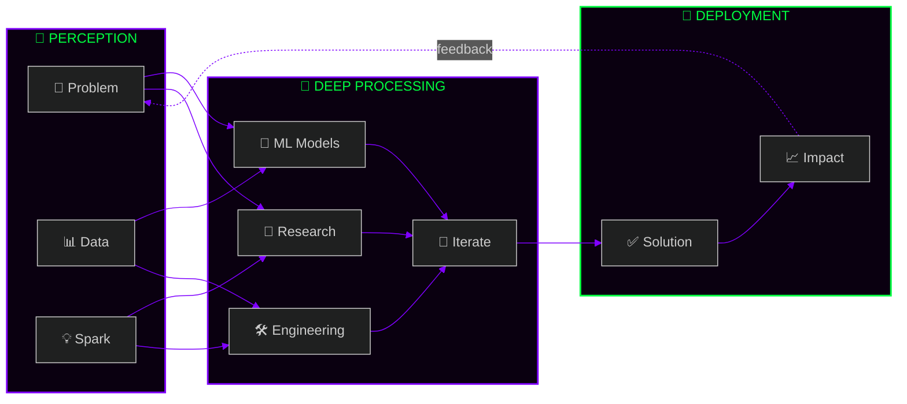

<!-- ████████████████████████████████████████████████████████████████████████████████
     ██                                                                          ██
     ██   Y A S H W A N T   K U M A R   C H I T C H U L A                       ██
     ██   CODENAME: chyk2468                                                     ██
     ██   CLEARANCE: ULTRA                                                       ██
     ██   STATUS: ONLINE                                                         ██
     ██                                                                          ██
     ████████████████████████████████████████████████████████████████████████████████ -->

<div align="center">

<!-- ═══════════════════ CINEMATIC HEADER ═══════════════════ -->


<!-- ANIMATED TERMINAL TYPING -->


<br/>

<!-- DYNAMIC BADGES ROW -->
<a href="https://github.com/chyk2468"></a>
<a href="https://github.com/chyk2468"></a>
<a href="https://github.com/chyk2468"></a>
<a href="mailto:chyk2468@gmail.com"></a>

<br/><br/>


</div>

---

<!-- ═══════════════════ SYSTEM BOOT SEQUENCE ═══════════════════ -->

<div align="center">

## `⟨ SYSTEM INITIALIZATION ⟩`

</div>

```
┌──────────────────────────────────────────────────────────────────────────────────┐
│                                                                                  │
│   ███████╗██╗   ██╗███████╗████████╗███████╗███╗   ███╗    ██████╗  ██████╗      │
│   ██╔════╝╚██╗ ██╔╝██╔════╝╚══██╔══╝██╔════╝████╗ ████║    ██╔══██╗██╔═══██╗    │
│   ███████╗ ╚████╔╝ ███████╗   ██║   █████╗  ██╔████╔██║    ██████╔╝██║   ██║    │
│   ╚════██║  ╚██╔╝  ╚════██║   ██║   ██╔══╝  ██║╚██╔╝██║    ██╔══██╗██║   ██║    │
│   ███████║   ██║   ███████║   ██║   ███████╗██║ ╚═╝ ██║    ██████╔╝╚██████╔╝    │
│   ╚══════╝   ╚═╝   ╚══════╝   ╚═╝   ╚══════╝╚═╝     ╚═╝    ╚═════╝  ╚═════╝    │
│                                                                                  │
│   [■■■■■■■■■■■■■■■■■■■■■■■■■■■■■■■■■■■■■■■■■■■■■■■■■■■■■■] 100%               │
│                                                                                  │
│   [✓] NEURAL_CORE .............. AI / ML Engineer ............... LOADED          │
│   [✓] FULLSTACK_MODULE ......... Web + Backend Dev .............. LOADED          │
│   [✓] RESEARCH_UNIT ............ Deepfake Detection ............. ACTIVE         │
│   [✓] EDUCATION_NODE ........... B.Tech CSE (AI & ML) ........... RUNNING        │
│   [✓] PASSION_DRIVE ............ AI Security & Ethics ........... OVERCLOCKED 🔥 │
│   [✓] CLOUD_INTERFACE .......... AWS (Learning Mode) ............ SYNCING ☁️     │
│   [✓] INNOVATION_ENGINE ........ Breaking AI Boundaries ......... ENGAGED ⚡     │
│   [✓] THREAT_DETECTION ......... Deepfake + Fake News ........... SCANNING 🔍    │
│                                                                                  │
│   > All modules initialized. yashwant.exe is running at full capacity.           │
│   > WARNING: Innovation levels exceeding safe thresholds. Proceeding anyway.     │
│                                                                                  │
└──────────────────────────────────────────────────────────────────────────────────┘
```

---

<!-- ═══════════════════ IDENTITY MATRIX ═══════════════════ -->

<div align="center">

## `⟨ IDENTITY MATRIX ⟩`
> *Reverse-engineering the developer*

</div>

```python
#!/usr/bin/env python3
"""
╔═══════════════════════════════════════════════════════════════════════════════╗
║  yashwant.core — v3.0.26 | CLASSIFIED: ULTRA                               ║
║  Last compiled: right now. Always compiling. Never stopping.                ║
╚═══════════════════════════════════════════════════════════════════════════════╝
"""

from __future__ import annotations
from universe import Engineer, Researcher, Builder, Innovator

class YashwantKumar(Engineer, Researcher, Builder, Innovator):
    """
    ╭───────────────────────────────────────────────────────────────────╮
    │  ⚠️  CAUTION: This engineer has been known to:                    │
    │     • Stay up until 3 AM "just fixing one more bug"              │
    │     • Accidentally build an entire ML pipeline in a weekend      │
    │     • Say "what if we add AI to it?" about everything            │
    │     • Turn coffee into production-grade code                      │
    │     Handle with curiosity. Side effects include innovation. 🔬   │
    ╰───────────────────────────────────────────────────────────────────╯
    """

    # ═══ CORE IDENTITY ═══
    CODENAME     = "chyk2468"
    REAL_NAME    = "Yashwant Kumar Chitchula"
    TITLE        = "AI/ML Engineer & Researcher"
    UNIVERSITY   = "B.Tech CSE — Artificial Intelligence & Machine Learning"
    LOCATION     = "India 🇮🇳"
    TIMEZONE     = "IST (UTC+5:30)"

    # ═══ WEAPON SYSTEMS ═══
    ARSENAL = {
        "🧠 intelligence" : ["Python", "TensorFlow", "PyTorch", "Scikit-Learn", "OpenCV"],
        "⚔️  languages"   : ["Python", "JavaScript", "C", "C++"],
        "🌐 web_stack"    : ["Node.js", "HTML5", "CSS3", "Streamlit"],
        "🗄️  databases"   : ["MySQL", "MongoDB"],
        "☁️  cloud"       : ["AWS", "Docker"],
        "🔧 tools"        : ["Git", "GitHub", "VS Code", "Jupyter"],
        "🤫 secret"       : "An unhealthy obsession with breaking AI to understand it",
    }

    # ═══ ACTIVE MISSIONS ═══
    CURRENT_OPS = [
        "🔐 Detecting deepfakes before they detect us",
        "🧠 Teaching machines to think responsibly",
        "🛡️ Building AI that protects, not deceives",
        "💻 Crafting full-stack apps that actually matter",
        "📡 Bridging AI research ↔ real-world deployment",
        "🔬 Turning 'what if?' into 'watch this.'",
    ]

    def __repr__(self) -> str:
        return "Not just a developer. An engineer who gives AI a conscience. 🤖❤️"

    def philosophy(self) -> str:
        return "If you can't explain how your AI works, you don't deserve to deploy it."


if __name__ == "__main__":
    yashwant = YashwantKumar()
    print(yashwant)
    # >>> Not just a developer. An engineer who gives AI a conscience. 🤖❤️
    yashwant.philosophy()
    # >>> If you can't explain how your AI works, you don't deserve to deploy it.
```

---

<!-- ═══════════════════ NEURAL MAP ═══════════════════ -->

<div align="center">

## `⟨ THE NEURAL MAP ⟩`
> *How problems enter my brain and exit as solutions*



> `ACTIVATION_FN = ReLU(Passion) × Sigmoid(Curiosity) + Bias(Coffee) ☕`


</div>

---

<!-- ═══════════════════ TECH ARSENAL ═══════════════════ -->

<div align="center">

## `⟨ WEAPONS SYSTEM / TECH ARSENAL ⟩`
> *Every tool in the armory*

<br/>

### 🧠 Intelligence Core — AI & ML


<br/><br/>

### ⚔️ Combat Languages


<br/><br/>

### 🌐 Web & Backend Arsenal


<br/><br/>

### ☁️ Cloud & DevOps Ops


<br/><br/>

### 🗄️ Data Fortresses


<br/>


</div>

---

<!-- ═══════════════════ MISSION CONTROL — STATS ═══════════════════ -->

<div align="center">

## `⟨ MISSION CONTROL / TELEMETRY ⟩`
> *Real-time performance metrics*

<br/>


<a href="https://github.com/chyk2468">
  
</a>

<br/><br/>


<br/><br/>

[](https://github.com/chyk2468)


</div>

---

<!-- ═══════════════════ FIELD REPORTS / PROJECTS ═══════════════════ -->

<div align="center">

## `⟨ FIELD REPORTS / DEPLOYED PROJECTS ⟩`
> *Every mission. Every deployment. Every impact.*

</div>

<br/>

<div align="center">

| # | 🚀 **Project** | 🧬 **Domain** | 📝 **Description** | 💥 **Status** |
|:-:|:---|:---|:---|:---:|
| 01 | [**MailMind-AI**](https://github.com/chyk2468/MailMind-AI) | AI / NLP / RAG | AI-powered email intelligence with RAG engine | 🟢 `LIVE` |
| 02 | [**Fake-News-Detection**](https://github.com/chyk2468/Fake-News-Detection) | NLP / ML | Machine learning news authenticity classifier | 🟢 `LIVE` |
| 03 | [**Fruit-Veg-Detector**](https://github.com/chyk2468/Fruit-Veg-Detector) | Computer Vision | CNN real-time fruit & vegetable classifier | 🟢 `LIVE` |
| 04 | [**My_love_pdf**](https://github.com/chyk2468/My_love_pdf) | Utility / Web | All-in-one PDF manipulation toolkit | 🟢 `LIVE` |
| 05 | [**Movie_Recommender**](https://github.com/chyk2468/Movie_Recommender) | ML / RecSys | Content-based movie recommendation system | 🟢 `LIVE` |
| 06 | [**Image-Upscaling-py**](https://github.com/chyk2468/Image-Upscaling-py) | Computer Vision | AI-powered image super-resolution tool | 🟢 `LIVE` |
| 07 | [**Smart-Helmet**](https://github.com/chyk2468/Smart-Helmet-for-industrial-safety-monitoring-using-esp32-and-Blynk) | IoT / Embedded | ESP32-based industrial safety monitoring helmet | 🟡 `R&D` |
| 08 | [**AmbitionBox-Scraper**](https://github.com/chyk2468/AmbitionBox-Companies-Web-Scraper) | Web Scraping | Company data intelligence scraper | 🟢 `LIVE` |
| 09 | [**SMOTE-IDS2017**](https://github.com/chyk2468/Application-of-the-SMOTETomek-Technique-to-Address-Class-Imbalance-in-the-CIC-IDS2017-Dataset) | Cybersecurity / ML | SMOTETomek for intrusion detection datasets | 🔬 `RESEARCH` |
| 10 | [**Machine-Learning-ML**](https://github.com/chyk2468/Machine-learning-ML-) | ML | Core ML experiments & algorithms collection | 📚 `ARCHIVE` |

</div>

<br/>

<div align="center">

> *"10 repos. 10 different problems. 1 obsession: making AI work for humans."*


</div>

---

<!-- ═══════════════════ LIVE METRICS & ACHIEVEMENTS ═══════════════════ -->

<div align="center">

## `⟨ LIVE SYSTEM METRICS ⟩`
> *Real-time intel from the field*

<br/>

<!-- DYNAMIC GITHUB BADGES -->
<a href="https://github.com/chyk2468?tab=repositories"></a>&nbsp;
<a href="https://github.com/chyk2468?tab=followers"></a>&nbsp;
<a href="https://github.com/chyk2468"></a>&nbsp;
<a href="https://github.com/chyk2468"></a>

<br/><br/>

<!-- RANDOM DEV JOKE -->
## `⟨ /dev/random/humor ⟩`
> *Because even neural networks need a laugh*

<a href="https://readme-jokes.vercel.app">
  
</a>

<br/><br/>

<!-- ACHIEVEMENTS -->
## `⟨ ACHIEVEMENTS UNLOCKED ⟩`
> *Trophies earned in the field*


<br/>


</div>

---

<!-- ═══════════════════ CONNECT ═══════════════════ -->

<div align="center">

## `⟨ ESTABLISH CONNECTION ⟩`

```
  ╔══════════════════════════════════════════════════════════════════════╗
  ║                                                                      ║
  ║   "The best code is written together.                                ║
  ║    The best AI is built with purpose.                                ║
  ║    Let's do both."                                                   ║
  ║                                                              — Y.K.  ║
  ║                                                                      ║
  ╚══════════════════════════════════════════════════════════════════════╝
```

<br/>

<a href="https://linkedin.com/in/yashwant-kumar-chitchula-117131290">
  
</a>&nbsp;&nbsp;
<a href="mailto:chyk2468@gmail.com">
  
</a>&nbsp;&nbsp;
<a href="https://bsky.app/profile/chyk2468.bsky.social">
  
</a>&nbsp;&nbsp;
<a href="https://github.com/chyk2468">
  
</a>

<br/><br/>


</div>

---

<!-- ═══════════════════ SHUTDOWN SEQUENCE ═══════════════════ -->

<div align="center">

## `⟨ SESSION TERMINATION ⟩`

```
  ┌──────────────────────────────────────────────────────────────────┐
  │                                                                  │
  │   $ shutdown --save-state --message "Until next compile..."      │
  │                                                                  │
  │   [✓] Session logged to /var/log/visitors.log                    │
  │   [✓] Neural weights saved to checkpoint_latest.pt               │
  │   [✓] All connections encrypted and archived                     │
  │   [✓] Coffee reserves: ████████░░ 78% [REFILL RECOMMENDED] ☕   │
  │   [✓] Innovation quotient: ████████████████████ MAXIMUM 🔥      │
  │                                                                  │
  │   > "Thanks for visiting my corner of the internet.              │
  │   >  Now go build something that makes the world think twice."   │
  │                                                                  │
  │   > Goodbye, traveler. The machines remember you. 🤖             │
  │                                                                  │
  └──────────────────────────────────────────────────────────────────┘
```

<br/>

<!-- RANDOM DEV QUOTE -->


<br/><br/>


<br/>

[](https://visitcount.itsvg.in)

<br/>

<sub>⚡ Engineered with obsession by <b>Yashwant Kumar</b> · Last deployed: 2026 · All systems nominal ⚡</sub>

</div>
