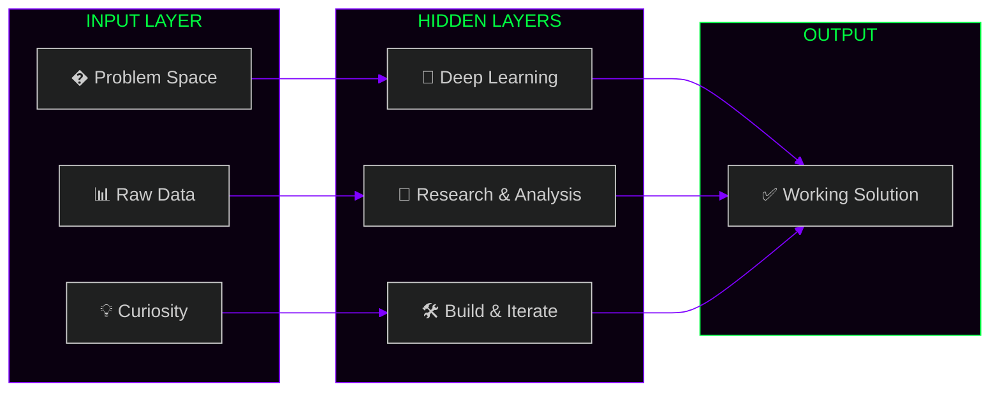

<!-- ████████████████████████████████████████████████████████████████████████
     ██   YASHWANT KUMAR CHITCHULA  —  GITHUB PROFILE README               ██
     ██   Theme: Neural Network / Terminal Boot / Sci-Fi                   ██
     ████████████████████████████████████████████████████████████████████████ -->

<div align="center">

<!-- ANIMATED TYPING — TERMINAL STYLE -->


<br/>

```
╔══════════════════════════════════════════════════════════════════════════════╗
║                                                                              ║
║   ██╗   ██╗ █████╗ ███████╗██╗  ██╗██╗    ██╗ █████╗ ███╗  ██╗████████╗      ║
║    ╚██╗██╔╝██╔══██╗██╔════╝██║  ██║██║    ██║██╔══██╗████╗ ██║╚══██╔══╝      ║
║     ╚███╔╝ ███████║███████╗███████║██║ █╗ ██║███████║██╔██╗██║   ██║         ║
║     ██╔██╗ ██╔══██║╚════██║██╔══██║██║███╗██║██╔══██║██║╚████║   ██║         ║
║    ██╔╝╚██╗██║  ██║███████║██║  ██║╚███╔███╔╝██║  ██║██║ ╚███║   ██║         ║
║    ╚═╝  ╚═╝╚═╝  ╚═╝╚══════╝╚═╝  ╚═╝ ╚══╝╚══╝ ╚═╝  ╚═╝╚═╝  ╚══╝   ╚═╝         ║
║                                                                              ║
║              [ INITIALIZING NEURAL NETWORK... PLEASE WAIT ]                  ║
╚══════════════════════════════════════════════════════════════════════════════╝
```


</div>

---

## `[SYSTEM BOOT LOG]`

```bash
$ boot --profile yashwant

[████████████████████████████████] 100%

[✓] CORE MODULE .......... AI / ML Engineer ............. LOADED
[✓] SUB MODULE ........... Full-Stack Developer ......... LOADED
[✓] RESEARCH UNIT ........ Deepfake Detection ........... ACTIVE
[✓] EDUCATION ............ B.Tech CSE (AI & ML) ......... RUNNING
[✓] PASSION DRIVE ........ AI Security .................. OVERCLOCKED 🔥
[✓] CLOUD INTERFACE ...... AWS (Learning Mode) .......... SYNCING...
[✓] CURRENT STATUS ....... Building the future 🚀........ ONLINE

> All modules initialized. Yashwant.exe is running.
```

---

<div align="center">

## `⟨ THE NEURAL MAP ⟩`
> *How I think about problems*



> `ACTIVATION FUNCTION: Passion × Curiosity + Coffee ☕`

</div>

---

## `⟨ WHO AM I ⟩`

```python
#!/usr/bin/env python3
# yashwant.core — v2.0.26

from universe import Engineer, Researcher, Builder

class YashwantKumar(Engineer, Researcher, Builder):
    """
    ┌─────────────────────────────────────────────────────────────┐
    │  WARNING: This developer may cause sudden bursts of         │
    │  innovation, unsolicited AI experiments, and late-night     │
    │  "what if we tried..." moments. Handle with curiosity. 🔬  │
    └─────────────────────────────────────────────────────────────┘
    """
    CODENAME   = "chyk2468"
    UNIVERSITY = "B.Tech CSE (AI & ML)"
    LOCATION   = "India 🇮🇳"
    TIMEZONE   = "IST (GMT+5:30)"

    WEAPONS_OF_CHOICE = {
        "primary"      : ["Python", "TensorFlow", "PyTorch"],
        "secondary"    : ["JavaScript", "Node.js", "C++"],
        "database"     : ["MySQL", "MongoDB"],
        "cloud"        : ["AWS ⬆️ (currently leveling up)"],
        "secret_weapon": "An obsession with breaking AI to understand it 🧠",
    }

    CURRENT_MISSIONS = [
        "🔐 Detecting deepfakes before they detect us",
        "🧠 Teaching machines to think responsibly",
        "💻 Building full-stack apps that actually matter",
        "📡 Bridging the gap between AI research & real-world use",
    ]

    def __repr__(self):
        return "Not just a developer. A person who gives AI a conscience. 🤖❤️"

yashwant = YashwantKumar()
print(yashwant)
# OUTPUT: Not just a developer. A person who gives AI a conscience. 🤖❤️
```

---

<div align="center">

## `⟨ WEAPON SYSTEM / TECH STACK ⟩`

### 🧠 Intelligence Core — AI & ML


### ⚙️ Build Core — Languages & Web


### 🛠️ Ops Core — Tools & Cloud


<br>


</div>

---

<div align="center">

## `⟨ MISSION CONTROL / GITHUB STATS ⟩`


<br><br>


<br>

[](https://github.com/ashutosh00710/github-readme-activity-graph)


</div>

---

<div align="center">

## `⟨ FIELD REPORTS / PROJECTS ⟩`

> *What I've built in the wild*

| 🚀 Project | 🔬 Domain | 💥 Status |
|:---|:---|:---:|
| **MailMind-AI** | AI-powered email intelligence | 🟢 LIVE |
| **Fake-News-Detection** | NLP + ML news classifier | 🟢 LIVE |
| **Fruit-Veg-Detector** | CNN real-time image classifier | 🟢 LIVE |
| **My-Love-PDF** | PDF tools suite | 🟢 LIVE |
| **Deepfake Detector** *(research)* | GAN forensics & face analysis | 🔴 CLASSIFIED |

</div>

---

<div align="center">

## `⟨ SIGNAL FREQUENCIES / CONTACT ⟩`

```
  ┌────────────────────────────────────────────────────────────┐
  │   Want to collaborate? Build? Break AI together?           │
  │   Here's how to reach the signal:                         │
  └────────────────────────────────────────────────────────────┘
```

[](https://linkedin.com/in/yashwant-kumar-chitchula-117131290)
[](mailto:chyk2468@gmail.com)
[](https://bsky.app/profile/chyk2468.bsky.social)
[](https://github.com/chyk2468)

<br>

## `⟨ THE COMMIT SNAKE ⟩`
> *Watch my contributions disappear...*

<picture>
  <source media="(prefers-color-scheme: dark)" srcset="https://raw.githubusercontent.com/chyk2468/chyk2468/output/github-snake-dark.svg" />
  <source media="(prefers-color-scheme: light)" srcset="https://raw.githubusercontent.com/chyk2468/chyk2468/output/github-snake.svg" />
  
</picture>

<br>

## `⟨ ACHIEVEMENTS UNLOCKED ⟩`


<br>


```
$ shutdown --message "Thanks for visiting. Now go build something incredible."

[✓] Session logged
[✓] Neural weights saved
[✓] Coffee levels: CRITICAL ☕

> Goodbye, traveler. The machines await. 🤖
```


[](https://visitcount.itsvg.in)

</div>
