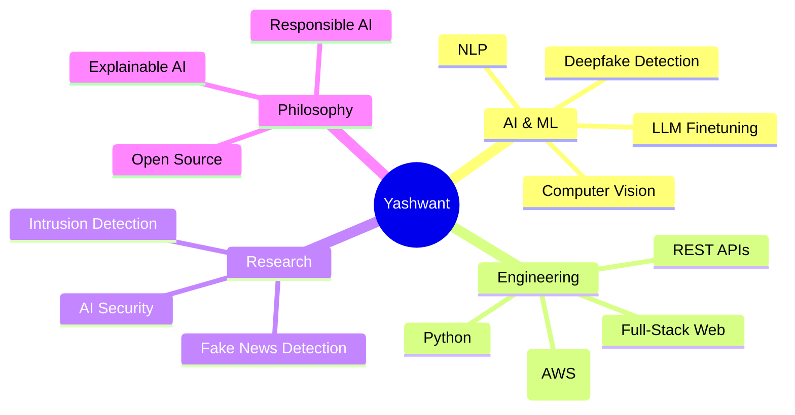

<div align="center">

<!-- ══════════════════ ANIMATED HEADER ══════════════════ -->


</div>

<!-- ══════════════════ PROFILE VIEWS + FOLLOW ══════════════════ -->
<div align="center">


[](https://github.com/chyk2468)
[](https://github.com/chyk2468)

</div>

<!-- ══════════════════ MULTI-LINE TYPING ANIMATION ══════════════════ -->
<div align="center">

<a href="https://github.com/chyk2468">
  
</a>

</div>

<br/>

<!-- ══════════════════ ABOUT ME ══════════════════ -->

## 🧬 Who am I?


```python
class YashwantKumar:
    name     = "Yashwant Kumar Chitchula"
    alias    = "chyk2468"
    uni      = "B.Tech CSE (AI & ML)"
    timezone = "IST (UTC+5:30)  🇮🇳"
    focus    = [
        "Deepfake Detection",
        "LLM Finetuning & AI Agents",
        "Scalable MLOps",
        "Secure AI Systems",
    ]
    currently_learning = ["AWS Cloud", "RAG Systems", "AI Ethics"]
    pronouns = "He / Him"

    def philosophy(self):
        return "If you can't explain how your AI\n" \
               "works, you don't deserve to deploy it."
```

<br/>
<br/>

<!-- ══════════════════ SOCIAL LINKS ══════════════════ -->

<div align="center">

[](https://linkedin.com/in/yashwant-kumar-chitchula-117131290)
[](mailto:chyk2468@gmail.com)
[](https://bsky.app/profile/chyk2468.bsky.social)
[](https://github.com/chyk2468)

</div>

<br/>

<!-- ══════════════════ TECH STACK ══════════════════ -->

## 🛠️ Tech Stack & Tools

<div align="center">

### 🤖 AI / Machine Learning


### 🌐 Web & Backend


### ☁️ Cloud, DevOps & Databases


</div>

<br/>

<!-- ══════════════════ GITHUB STATS DASHBOARD ══════════════════ -->

## 📊 GitHub Analytics Dashboard

<div align="center">

<table border="0" width="100%">
  <tr>
    <td align="center" width="50%">
      <a href="https://github.com/chyk2468">
        
      </a>
    </td>
    <td align="center" width="50%">
      <a href="https://github.com/chyk2468">
        
      </a>
    </td>
  </tr>
  <tr>
    <td align="center" colspan="2">
      <a href="https://github.com/chyk2468">
        
      </a>
    </td>
  </tr>
</table>

</div>

<br/>

<!-- ══════════════════ SNAKE ANIMATION ══════════════════ -->

## 🐍 Dynamic Contribution Snake

<div align="center">
  <picture>
    <source media="(prefers-color-scheme: dark)" srcset="https://raw.githubusercontent.com/chyk2468/chyk2468/output/dist/github-snake-dark.svg" />
    <source media="(prefers-color-scheme: light)" srcset="https://raw.githubusercontent.com/chyk2468/chyk2468/output/dist/github-snake.svg" />
    
  </picture>
</div>

<br/>

<!-- ══════════════════ ACTIVITY GRAPH ══════════════════ -->

## ⚡ Live Neural Activity

<div align="center">
  <a href="https://github.com/chyk2468">
    
  </a>
</div>

<br/>

<!-- ══════════════════ PROJECTS TABLE ══════════════════ -->

## 🚀 Deployed Operations

<div align="center">

| # | Project | Domain | Status |
|:-:|:--|:--|:-:|
| 01 | [**MailMind-AI**](https://github.com/chyk2468/MailMind-AI) — *AI-powered email intelligence with RAG* | `AI / NLP / RAG` | 🟢 LIVE |
| 02 | [**Fake-News-Detection**](https://github.com/chyk2468/Fake-News-Detection) — *ML news authenticity classifier* | `NLP / ML` | 🟢 LIVE |
| 03 | [**Fruit-Veg-Detector**](https://github.com/chyk2468/Fruit-Veg-Detector) — *CNN real-time classifier* | `Computer Vision` | 🟢 LIVE |
| 04 | [**Movie_Recommender**](https://github.com/chyk2468/Movie_Recommender) — *Content-based recommender* | `ML / RecSys` | 🟢 LIVE |
| 05 | [**Image-Upscaling-py**](https://github.com/chyk2468/Image-Upscaling-py) — *AI super-resolution tool* | `Computer Vision` | 🟢 LIVE |
| 06 | [**My_love_pdf**](https://github.com/chyk2468/My_love_pdf) — *All-in-one PDF toolkit* | `Utility / Web` | 🟢 LIVE |
| 07 | [**AmbitionBox-Scraper**](https://github.com/chyk2468/AmbitionBox-Companies-Web-Scraper) — *Company data scraper* | `Web Scraping` | 🟢 LIVE |
| 08 | [**Smart-Helmet**](https://github.com/chyk2468/Smart-Helmet-for-industrial-safety-monitoring-using-esp32-and-Blynk) — *ESP32 IoT safety system* | `IoT / Embedded` | 🟡 R&D |
| 09 | [**SMOTE-IDS2017**](https://github.com/chyk2468/Application-of-the-SMOTETomek-Technique-to-Address-Class-Imbalance-in-the-CIC-IDS2017-Dataset) — *Intrusion detection research* | `Cybersecurity / ML` | 🔬 RESEARCH |
| 10 | [**Machine-Learning-ML**](https://github.com/chyk2468/Machine-learning-ML-) — *Core ML experiments* | `ML` | 📚 ARCHIVE |

</div>

<br/>

<!-- ══════════════════ PINNED REPOS ══════════════════ -->

<div align="center">
<table border="0" width="100%">
  <tr>
    <td width="50%">
      <a href="https://github.com/chyk2468/MailMind-AI">
        
      </a>
    </td>
    <td width="50%">
      <a href="https://github.com/chyk2468/Fake-News-Detection">
        
      </a>
    </td>
  </tr>
  <tr>
    <td width="50%">
      <a href="https://github.com/chyk2468/Fruit-Veg-Detector">
        
      </a>
    </td>
    <td width="50%">
      <a href="https://github.com/chyk2468/Image-Upscaling-py">
        
      </a>
    </td>
  </tr>
</table>
</div>

<br/>

<!-- ══════════════════ ACHIEVEMENTS ══════════════════ -->

## 🏆 Achievements Unlocked

<div align="center">
  <a href="https://github.com/ryo-ma/github-profile-trophy">
    
  </a>
</div>

<br/>

<!-- ══════════════════ MERMAID MINDMAP ══════════════════ -->

## 🧠 Research Focus Mindmap


```mermaid
mindmap
  root((Yashwant))
    AI & ML
      Deepfake Detection
      LLM Finetuning
      Computer Vision
      NLP
    Engineering
      Python
      Full-Stack Web
      REST APIs
      Cloud (AWS)
    Research
      AI Security
      Fake News Detection
      Intrusion Detection
    Philosophy
      Explainable AI
      Responsible AI
      Open Source
```

<br/>

<!-- ══════════════════ INTERACTIVE TOGGLES ══════════════════ -->

## 🎮 Interactive Extras (Click Me!)

<details>
<summary>🃏 <b>Generate a Random Dev Joke</b></summary>
<br/>
<div align="center">
  
</div>
<br/>
</details>

<details>
<summary>🏅 <b>Full Trophy Cabinet</b></summary>
<br/>
<div align="center">
  
</div>
<br/>
</details>

<details>
<summary>📜 <b>My Developer Manifesto</b></summary>
<br/>

```text
╔═══════════════════════════════════════════════════════════════════╗
║  DEVELOPER MANIFESTO — chyk2468  v3.0.2026                       ║
╠═══════════════════════════════════════════════════════════════════╣
║                                                                   ║
║  I.   Build AI you can explain. Fully. Always.                   ║
║  II.  A model with no ethics is a weapon.                        ║
║  III. Code is poetry. Document it like one.                      ║
║  IV.  The best bug fix is to never need one. But fix it anyway.  ║
║  V.   Ship. Iterate. Learn. Repeat.                              ║
║  VI.  Coffee is fuel. Curiosity is power.                        ║
║  VII. Open-source is how we pay it forward.                      ║
║                                                                   ║
╚═══════════════════════════════════════════════════════════════════╝
```

</details>

<details>
<summary>💻 <b>Launch the Interactive Terminal</b></summary>
<br/>


</details>

<br/>

<!-- ══════════════════ QUOTE ══════════════════ -->

<div align="center">

> *"The best way to predict the future is to build it."*
> — **Alan Kay**

<br/>


<sub>⚡ Engineered with obsession by <b>Yashwant Kumar</b> · 2026 · All systems nominal ⚡</sub>

</div>
